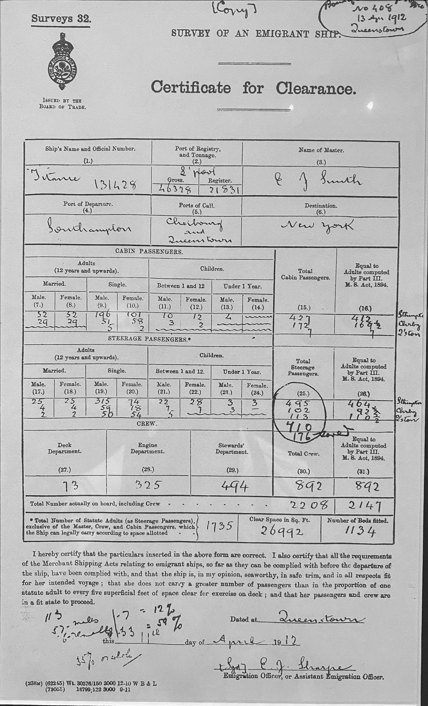

Titanic Visualization
================



[Photo Credit: exhibit at Museo del Mar, 360 C. de San Francisco, San Juan, 00901, Puerto Rico]


## Introduction

Welcome to this exciting exercise where we delve into the visualization of the Titanic dataset using R. Data visualization is a powerful tool that allows us to uncover insights and patterns within data through graphical representations such as charts, graphs, and maps. In this notebook, we will be utilizing the Seaborn Library to create visually appealing and informative plots.

The Titanic dataset serves as a captivating backdrop for our exploration, not only for its rich features but also for the poignant narrative it carries. The tragic sinking of the Titanic on its maiden voyage is a story that resonates with many, intertwined with tales of love, loss, and survival. It presents a unique opportunity to analyze how factors such as socio-economic status, family size, and other variables influenced the chances of survival during this historic event.

As we embark on this journey of data visualization, we will unravel intriguing insights such as the dynamics between wealth and survival, the impact of family size on survival rates, and other compelling patterns that emerge from the dataset. Join me as we navigate through this script and uncover the hidden stories within the Titanic dataset. Let's begin our exploration!

## Notebook

You can include R code in the document as follows:

``` r
titanic <- titanic_train %>%
  select(Survived, Pclass, Sex, Age, SibSp, Parch, Fare) %>%
  mutate(Survived = factor(Survived),
         Pclass = factor(Pclass),
         Sex = factor(Sex))
```


